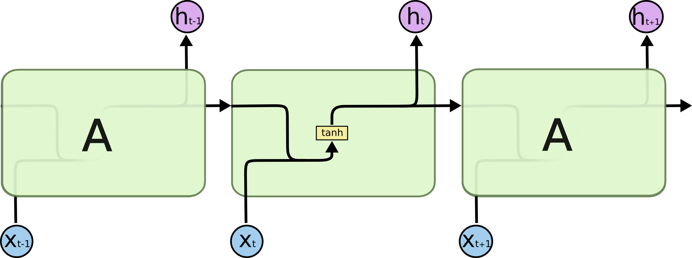
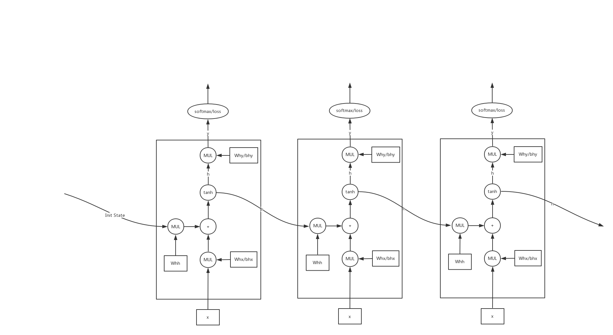
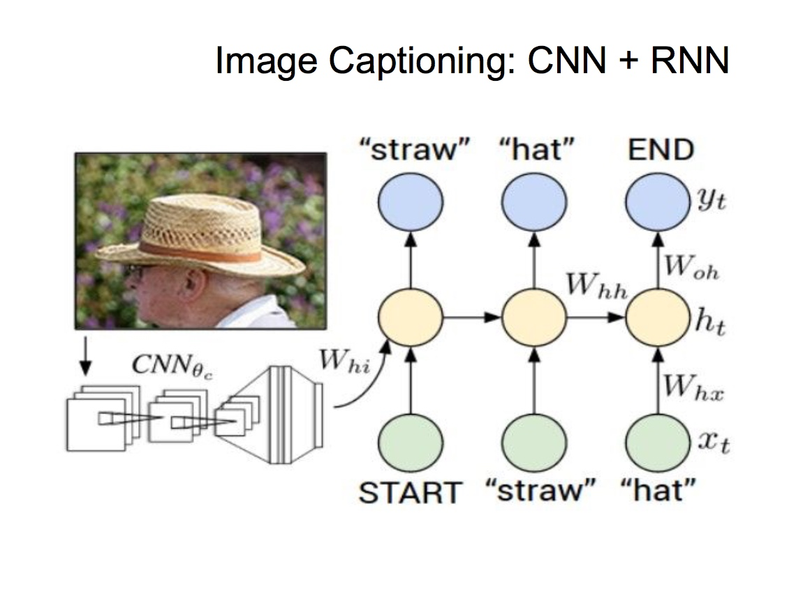

# RNN/LSTM结构整理

参考[LSTM](http://colah.github.io/posts/2015-08-Understanding-LSTMs/)

## 前言

循环神经网络(Recurrent Neural Network, RNN)是一种用于**序列结构**的神经网络，其输入和输出都可以使序列形式，也可以是值，RNN可以解决以下的一些有关序列的问题，所谓序列，就是有序的输入，典型的序列如**文字序列**，**音频/视频序列**，**时间序列**等等，都可以使用RNN来处理。

## RNN的使用场景

RNN的核心特点在于能够记住context，也是序列处理的关键所在，RNN的主要应用场景有以下几个：

- `one2one`:和传统的神经网络一致，输入和输出，如传统的值预测，分类问题
- `one2many`:一次输入，序列输出，典型的应用是看图说话，一张图作为输入后输出一个序列的单词
- `many2one`:解决的是序列输入，单值输出的问题，典型的应用是判断一句话的情绪的情绪是否是积极的，或是输入邮件判断是否是垃圾邮件，注意:**传统的机器学习也可以判断垃圾邮件，不过是把邮件中的word数量统计当做是一个大向量作为一个特征输入，最后得出一个垃圾邮件概率，但是RNN可以将序列一个个输入进去**
- `many2many`:序列输入，序列输出，典型应用例如聊天软件，**机器翻译**等应用，输入的是文字序列，输出的也是文字序列，因此RNN在NLP中的应用也非常丰富。

## 传统RNN

RNN的基本结构如图所示，最主要的是中间那一条由$A \rightarrow A$的那一条线，这条线的主要目的是将上一轮隐含层的输出$h$作为本轮隐含层的输入，达到记录context的目的,有几种方法：

1. 每一个轮次将$[h_t, x_t]$横向拼接为一个特征向量，传入隐含层中，假设h=10, x特征向量的维数是100，这样，需要一个110*10的权值矩阵如下图所示，表达式如下：

$$
    h_t = tanh(W_f[h_{t-1}, x_t] + b_f)    
$$

连起来以后就是这样：

2. 第二种方法是使用加法：

$$
    h_t = tanh(W_{hh} \cdot h_{t-1} + Whx \cdot x_t + b)
    \\ y = softmax(W_{hy}\cdot h_t) 
$$
这种方法的实现在[这里](https://gist.github.com/karpathy/d4dee566867f8291f086)

## 传统RNN存在的问题

传统RNN最大的问题是**梯度爆炸**和**梯度消失**问题，如下图是一个简单的BPTT的代码，forward的时候，相当于是多次乘以同一个矩阵$W_{hh}$，BP的时候也会多次乘以$W_{hh}$因此当$W_{hh}$的特征值大于1的时候就出现了梯度爆炸，小于0的时候梯度消失，而LSTM这种情况比较轻（为什么呢？）

## LSTM

传统的RNN存在一些问题：

- 有时候需要短期记忆，如同一句话中的"cloud"和"sky"，但是有时候却需要长期记忆，如上文中几句话前说过"我出生在法国"可以推断，"我说X语"，中的X是法语，诸如这样的应用，需要靠长短期的记忆来实现，虽然RNN默认支持这种记忆，但是由于RNN中的梯度消失等问题，长期的记忆很难被记录下来，而短期的记忆又比较强烈。
- RNN的一个典型问题是梯度消失和梯度爆炸：RNN的反向传播是穿过时间轴的，因此反向传播的时候，每一次向t-1传播就要乘一个$W_{hh}$，当$t$比较大的时候，如果$W_{hh}$的特征值大于0——梯度爆炸，$W_{hh}$的特征值小于0——梯度消失。

LSTM主要解决长短期记忆的问题，主要结构如下图，其中$C_t$用来存储记忆知识，$C_t$的形状通常是和$h_t$一致，是一个向量。

LSTM主要有这三种结构：

- **忘记门（Forget Gate)**：用来忘记$C_t$中的知识，$f_t$是一个与$C_t$相同形状的矩阵，每一个位置是[0, 1]范围内的，0表示全部忘记，1表示所有都记住，和$C_t$做一个elementwise乘法，这样传过去的就是忘记后剩下的知识。

$$
    f_t = \sigma(W_f \cdot [h_{t-1}, x_t]  + b_f)
$$
“温故”后的知识为$f_t \odot C_t$。

- **输入门（Input Gate）**：用来生成新的记忆加入到$C_t$中，具体的分为两个，$\tilde{C_t}$用来生成新的记忆$i_t$用于表示新生成的记忆有多少加入$C_t$中。

$$  
    \tilde{C_t} = tanh(W_C \cdot [h_{t-1}, x_t]  + b_C) \\
    i_t = \sigma (W_i \cdot [h_{t-1}, x_t]  + b_i) 
$$
“知新”新的知识表示为$i_t \odot \tilde{C_t}$，准备合成知识

- **输出门（Output Gate）**：输出门主要负责把“温故知新”后合成的知识与当前输入x拼合作为输入做仿射变换，产生最终的输入$h_t$，【注】$\odot$表示elementwise乘法

$$
    C_t = f_t \odot C_{t-1} +  i_t \odot \tilde{C_t}
    \\o_t = W_o \cdot [h_{t-1}, x_t] + b_o 
    \\h_t = o_t \odot tanh(C_t)
$$

这里注意一下，为了提高运算速度，必须减少小矩阵的运算，尽量将多个小矩阵运算合成大矩阵运算，这里可以知道，对于$f_t, i_t, o_t, \tilde{C_t}$的计算，都是简单的一个仿射变换加，$Wx + b$可以把以上几个运算合成为一个大矩阵运算，即:
$$
    [f_t', i_t', \tilde{C_t}', o_t'] = W \cdot [h_{h-1}, x_t] + b
$$
其中，W是一个[H+F, 4H]的矩阵，F指X的特征数，这样计算完以后在分开，可以加快速度

## LSTM与ResNet的联系

去掉忘记门f后可以看到其实LSTM每个Timestep中cell的输出是$C_t = C_{t-1} +  i_t \odot \tilde{C_t}$，其实与ResNet中计算$h(x) = f(x) + x$从而求出$f(x) = h(x) - x$的想法异曲同工，不过ResNet的f使用的是卷积，而LSTM使用elementwise的sigmoid函数过滤得到，两者的方式不一样。

## CNN配合RNN做看图说话

看图说话是通过一些图片的Caption，能够从测试图片中生成文字序列的应用，由于CNN对图片的特征提取是最好的，常常使用CNN作为特征提取器结合RNN作为序列预测器，可以做到说出一些有意义的文字，RNN，CNN结合的示意图如下：

可以看到整个过程是这样的：首先通过**预训练好的CNN**提取特征后，通过FC层转换为H个隐藏单元的特征，即每张图像由[Width*Height]特征数提取为[H]的sample，然后把这个特征作为RNN的init_state输入，这里的图像只输入一次，***cs231n课上有人问是否需要把cnn取得的的1000维特征加入到每一步的输入中，而不只是在初始的时候加入，老师的回答是效果没有初始加入好，这个说法有待验证**，RNNCaptioning的具体算法的示意图如下图所示：

要特别注意的是几点：

- 所有的输入，输出矩阵前面都加上了minibatch size=N这个维度
- 这里合并hh和x的方法使用的是本文所说的第二种方法$tanh(W_{hh} \cdot h_{t-1} + Whx \cdot x_t + b)$，因此两个矩阵分别是[H, H]和[D, H]
- 在最后计算loss的方法**不同于**普通的RMSE或者Cross Entropy，因为需要对N个样本的T个输入一起计算loss，因此需要将N\*T个预测值与N\*T个真实值$y_{true}$做比较，具体步骤如下：
    - 集合所有的预测输出y_pred[N, T, V]与y_true[N, T, V]放到一个向量里面
    - 将y_pred和y_true展平为[N*T, V]
    - 对展平后的y_pred和y_true做crossentropy，求出loss，返回来得到dout[N*T, V]后重新切分为[N, T, V]
- 最后计算BP阶段按照如下路径顺序：
    - dout[N, T, V]按照T维度得到dout[N, V]
    - 倒回去计算dWhv和dRNNout
    - 使用dRNNout和dnext_h计算dprev_h和RNN层内的dW，再继续求出dEmbedout和dWe
    - 如此重复T步后剩下一个dprev_h传给出，求dWih结束

